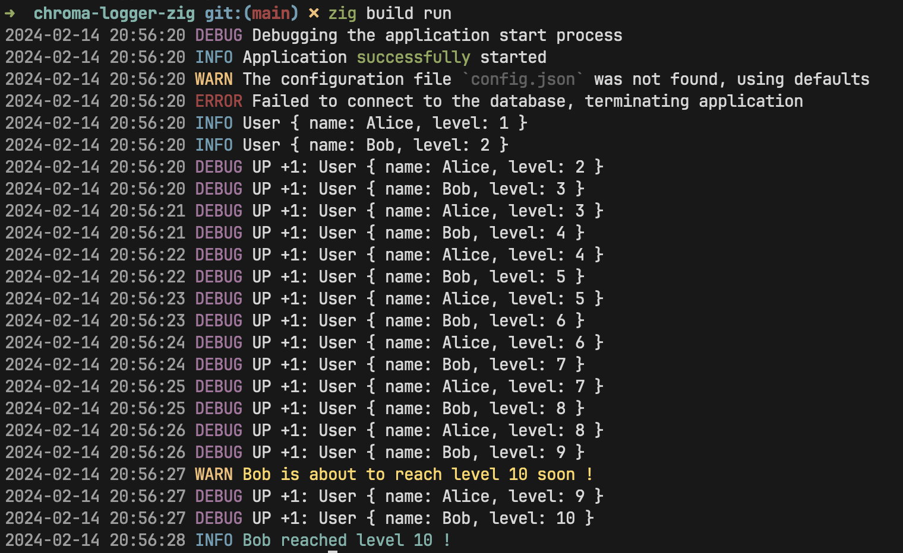
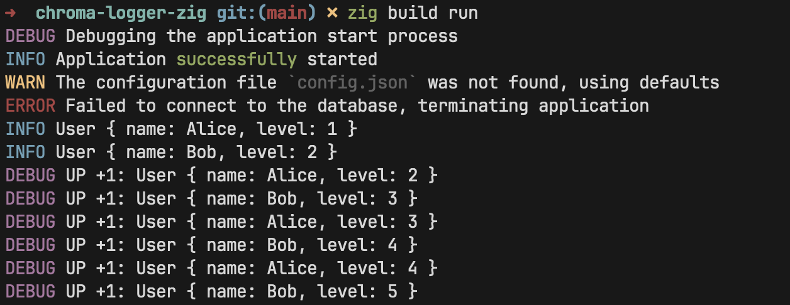
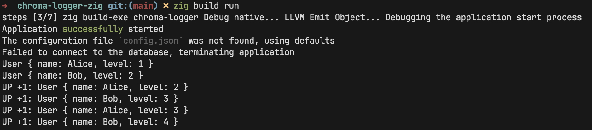

# Chroma Logger for Zig

Chroma Logger is an advanced logging library for Zig projects, designed to bring color and clarity to your application's logging output. Utilizing the Chroma library for colorized output, Chroma Logger enhances the visibility and readability of logs, making debugging and monitoring a breeze.



## Table of Contents

- [Features](#features)
- [Getting Started](#getting-started)
  - [Prerequisites](#prerequisites)
  - [Installation](#installation)
- [Usage](#usage)
  - [Setting Up](#setting-up)
  - [Logging Example](#logging-example)
- [Contributing](#contributing)
- [License](#license)
- [Acknowledgments](#acknowledgments)

## Features

- **Colorized Logging**: Leverage the full spectrum of ANSI colors, including 256-color and true color support, to differentiate log levels and messages.
- **Flexible Configuration**: Control log levels and formatting with ease, allowing for detailed debugging sessions or streamlined production logs.
- **Seamless Integration**: Designed to work effortlessly within the Zig ecosystem, integrating directly into your Zig build system.

The logger comes in different styles, each with its own use case:

- `Time based`: Logs are colorized based on the time of day.
<figure>
  
    <figcaption style="text-align: center; font-style: italic;">ChromaLogger.timeBasedLog</figcaption>
</figure>

- `Level based`: Logs are colorized based on the log level.
<figure>
  
    <figcaption style="text-align: center; font-style: italic;">ChromaLogger.log<figcaption>
</figure>

- `Default based`: Logs are displayed in the default color.
<figure>
  
    <figcaption style="text-align: center; font-style: italic;">ChromaLogger.defaultLog<figcaption>
</figure>

## Getting Started

### Prerequisites

Ensure you have Zig version 0.12.0-dev.2701+d18f52197 or newer installed on your system.

### Installation

1. Fetch the project using `zig fetch`

```bash
zig fetch --save https://github.com/adia-dev/chroma-logger-zig/archive/refs/tags/v0.1.0.tar.gz
```

Or manually paste this in your `build.zig.zon`

```zig
.dependencies = .{
    // other deps...
    .@"chroma-logger" = .{
        .url = "https://github.com/adia-dev/chroma-logger-zig/archive/refs/tags/v0.1.0.tar.gz",
        .hash = "1220359dd4fb54e367f2aa310b2cf75227aec8f05b254ef93f3bafef34ee2aa39d0b",
    },
    // ...
},
```

2. **Build the project**:

Using the Zig build system, compile the library and example application:

```bash
zig build
```

This command compiles the static library and an example executable demonstrating the Chroma Logger in action.

## Usage

To integrate Chroma Logger into your Zig project, include it as a package in your `build.zig` file and use it to log messages in various colors and formats:

### Setting Up

In your `build.zig`:

```zig
const std = @import("std");

pub fn build(b: *std.Build) void {
    ...
    const chroma_logger_dep = b.dependency("chroma-logger", .{});
    ...
    exe.root_module.addImport("chroma-logger", chroma_logger_dep.module("chroma-logger"));
    ...
}
```

### Logging Example

In your application:

```zig
const std = @import("std");
const ChromaLogger = @import("chroma-logger");

// LogFns:
// - ChromaLogger.defaultLog
// - ChromaLogger.timeBasedLog
// - ChromaLogger.log

pub const std_options: std.Options = .{
    .logFn = ChromaLogger.log,
    .log_level = .debug,
};

pub fn main() !void {
    std.log.info("Application started successfully", .{});
    std.log.err("Failed to load configuration", .{});
}
```

This example demonstrates how to use Chroma Logger to log messages in various colors and formats. The `log` function from the `ChromaLogger` package is used to log messages, and the `std.log` package is used to log messages in the standard Zig format.

For more examples and usage, please refer to the [Use Chroma Logger](https://github.com/adia-dev/use-chroma-logger) repository.

## Contributing

We welcome contributions of all kinds from the community! Whether it's adding new features, improving documentation, or fixing bugs, please feel free to make a pull request.

## License

This project is licensed under the MIT License - see the [LICENSE.md](LICENSE.md) file for details.

## Acknowledgments

- [Chroma](https://github.com/adia-dev/chroma-zig) - The underlying library providing colorized output for Chroma Logger.
